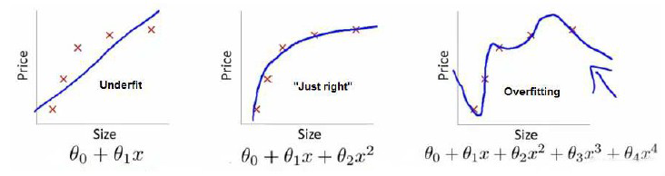

# Linear Regression

## Least Square Method

> 概要
> > 最小二乘法的矩阵表达和几何意义
> > 从概率角度来看，最小二乘法就是噪声为高斯分布的MLE
> > 正则化
> > > L1 $\rightarrow$ Lasso
> > > L2 $\rightarrow$ Ridge（岭回归）
***

### 线性回归要干什么

线性回归是利用数理统计中回归分析，来确定两种或两种以上变量间相互依赖的定量关系的一种统计分析方法，运用十分广泛。其表达形式为

$$
y = w^Tx+e(e\sim{N(0,\sigma^2)})
$$
***

### 线性回归的矩阵表述及其几何意义

假设现在给定的数据集为：

$$
D=\{(x_1,y_1),(x_2,y_2),\cdots,(x_n,y_n)\},x_i\in\mathbb{R}^p,y_i\in\mathbb{R}
$$

我们定义：
$$
\begin{gathered}
    X=(x_1,x_2,\cdots,x_n)^T \\
    Y=(y_1,y_2,\cdots,y_n)^T \\
    f(W)=W^TX,W\in\mathbb{R}^p
\end{gathered}
$$

对于最小二乘法，类似于统计中的均方误差，我们定义：
$$
\begin{aligned}
    S(W)&=\parallel{W^TX-Y}\parallel^2_2 \\
        &=(XW-Y)^T(XW-Y) \\
        &=W^TX^TXW-2W^TX^TY-Y^TY
\end{aligned}
$$
对$W$进行估计，有 $\hat{W}=\argmin\limits_W{S(W)}$，类似于MLE：
$$
\begin{aligned}
    \dfrac{\partial{S(W)}}{\partial{W}}&=X^TXW+W^TX^TX-2X^TY \\
    &=2X^TXW-2X^TY \\
    &=0
\end{aligned}
$$
> $X^TXW=(W^TX^TX)^T\in\mathbb{R}$

因为$X^TX$可逆，所以$W=X^\dagger{Y}$
>其中$X^\dagger=(X^TX)^{-1}X^T$，读作$X$的伪逆
***

### 几何解释

$X_{\cdot1},X_{\cdot2},\cdots,X_{\cdot{p}}$形成了一个$\mathbb{R}^n$空间的$p$维子空间，现在需要在这个子空间中，找到和$Y$最接近的一个向量。
不难发现这个向量就是$Y$在该子空间中的投影，我们可以把投影向量表示成$W^TX$，由投影的性质可知，

$$
\forall{1\leq{i}\leq{p}},Y-W^TX\perp{X_{\cdot{i}}}
$$
所以，
$$
\begin{gathered}
    & X_{\cdot1}^T\cdot(Y-W^TX)=0 \\
    & X_{\cdot2}^T\cdot(Y-W^TX)=0 \\
    & \cdots \\
    & X_{\cdot{p}}^T\cdot(Y-W^TX)=0 \\
    & \\
    \Rightarrow& {X}^T(Y-W^TX)=0 \\
    \Rightarrow& W=(X^TX)^{-1}X^TY
\end{gathered}
$$
***

### 概率角度

我们假设$y=f(W)+\epsilon$，其中$\epsilon\in{N(0,\sigma^2)}$，为数据的噪声。
所以有

$$
y|x;W\in{N(W^Tx,\sigma^2)}
$$
对$W$进行极大似然估计(MLE)
$$
\begin{aligned}
    \mathcal{L(W)}&=\ln(P(Y\mid{X};W)) \\
    &\overset{iid}{=}\ln{\prod_{i=1}^{n}P(y_i\mid{x_i;W})} \\
    &=\sum_{i=1}^{n}\ln{P(y_i\mid{x_i;W})} \\
    &\overset{Gauss}{=}\sum_{i=1}^{n}(\ln(\frac{1}{\sqrt{2\pi}\sigma})+\ln(\exp(-\frac{(y_i-W^Tx_i)^2}{2\sigma^2}))) \\
    &=\sum_{i=1}^{n}(\ln(\frac{1}{\sqrt{2\pi}\sigma})-\frac{(y_i-W^Tx_i)^2}{2\sigma^2}) \\
    \hat{W}&=\argmax_W\mathcal{L(W)} \\
    &=\argmax_W\sum_{i=1}^{n}(-\frac{(y_i-W^Tx_i)^2}{2\sigma^2}) \\
    &=\argmin_W\sum_{i=1}^{n}(y_iW^Tx_i)^2 \\
    &=\argmin_W\parallel{XW-Y}\parallel^2_2
\end{aligned}
$$
得到了和之前一样的结论。
> $LSE\overset{\text{Noise}\sim{N}}{\Longleftrightarrow}MLE$
***

### 正则化

> 引入正则化是为了解决$\hat{W}$中$X^TX$不可逆的问题。  
> 正常来讲，对于数据样本我们有$n\gg{p}$，但是当样本数量不足或维数特别大的时候会出现过拟合，为了解决过拟合我们有三种办法：
> > 加数据  
> > 特征选择/特征提取  
> > 正则化

在我们对一些数据进行拟合的时候，我们可能会使用一些非线性函数（把$x^2,x^3,...$当作新的特征值），当我们多项式的次数越来越高的时候，我们的曲线会越来越贴近我们的训练集，但是也会变得不够平滑，出现震荡的现象，这就是所谓的过拟合（overfitting）。

解决这个问题的一个直观的想法是限制高次项的系数，在此例中就是对$\theta_3,\theta_4$进行约束，将Loss Function改为和下面类似的函数：
$$
    J(\theta):=J(\theta)+1000\theta_3+1000\theta_4
$$
后两项就是新添的惩罚因子，更一般的，我们可以对所有的特征值都施加一定的惩罚，由此也引出了正则化的框架：
$$
    \argmin_W[L(W)+\lambda{P(W)}]
$$
其中，$L(W)$是损失，$P(W)$是惩罚，根据采取的范数的不同，正则化又分为：
$$
\begin{aligned}
    &\mathcal{l_1}: \text{Lasso},P(W)=\parallel{W}\parallel_1 \\
    &\mathcal{l_2}: \text{Ridge},P(W)=\parallel{W}\parallel_2^2=W^TW（\text{岭回归，又称权值衰减}）
\end{aligned}
$$
下面讨论岭回归（概率角度）：
$$
\begin{aligned}
    \mathcal{J(W)}&=L(W)+\lambda{P(W)} \\
    &=(W^TX-Y)^T(W^TX-Y)+\lambda{W}^TW \\
    &=W^T(X^TX+\lambda{I})W-2W^TX^TY-Y^TY \\
    \dfrac{\partial{\mathcal{J}(W)}}{\partial{W}}&=2(X^TX+\lambda{I})W-2X^TY \\
    &=0 \\
    \hat{W}&=\argmin_W\mathcal{J(W)} \\
    &=(X^TX+\lambda{I})^{-1}X^TY
\end{aligned}
$$
此时$X^TX+\lambda{I}$一定正定，因为对于$\forall{\vec{z}}\neq\vec{0}$，总有
$$
\begin{aligned}
    z^T(X^TX+\lambda{I})z&=(Xz)^T(Xz)+\lambda{z^Tz} \\
    &\geq\lambda{z^Tz}>0
\end{aligned}
$$
因为$X^TX+\lambda{I}$是正定矩阵，必然可逆。
贝叶斯角度：
$$
    W\sim{N(0,\sigma_0^2)}
$$
用最大后验估计$MAP$：
$$
\begin{aligned}
    \hat{W}&=\argmax_W(P(W\mid{y})) \\
    &=\argmax_W\dfrac{P(y\mid{W})\cdot{P(W)}}{P(y)} \\
    &=\argmax_W\prod_{i=1}^{n}P(y\mid{W})\cdot{P(W)} \\
    &=\argmax_W(\sum_{i=1}^{n}(\ln(\frac{1}{\sqrt{2\pi}\sigma})-\frac{(y_i-x_iW)^2}{2\sigma^2})+\ln(\frac{1}{\sqrt{2\pi}\sigma_0})-\frac{W^TW}{2\sigma_0^2}) \\
    &=\argmin_W(\sum_{i=1}^{n}(y_i-W^Tx_i)^2+\frac{\sigma^2}{\sigma_0^2}W^TW)
\end{aligned}
$$
令$\lambda=\dfrac{\sigma^2}{\sigma_0^2}$，$\hat{W}$和概率角度得出的估计值完全一致。
> ${Regularized\;LSE}\xLeftrightarrow[Noise\sim{N}]{prior\sim{N}}MAP$
