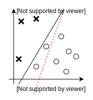
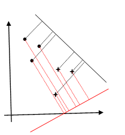
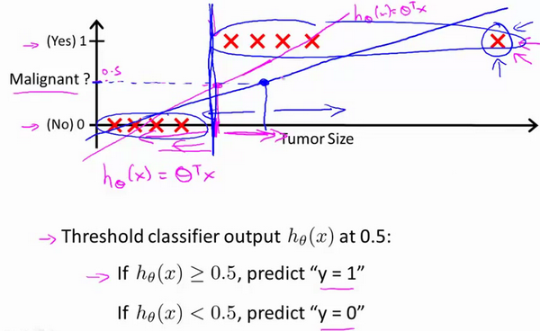

# Linear Classification

## Background

上一讲提到的线性回归，是机器学习的基础。线性回归具有**线性、全局性、数据未加工**三个特点，打破这些特点我们就可以获得新的模型。

线性回归解决的是对新的数据的函数值的预测（如房价，时间），而线性分类则是对新数据类的预测（如天气，是否为良性肿瘤）。
线性回归和线性分类的关系可以这么理解：

$$
    \text{线性回归}\xrightarrow{激活函数}\text{线性分类}
$$

这实际上也是一种**降维**，关于激活函数（activation function）$\mathcal{f}:w^Tx+b$，根据其值域可以分为两种：
&emsp;&emsp;1). 软分类：$\mathcal{f}:\mathbb{R}^P\rightarrow[0,1]$  
&emsp;&emsp;2). 硬分类：$\mathcal{f}:\mathbb{R}^P\rightarrow\{0,1\}$
激活函数的反函数$\mathcal{f}^{-1}$称为链接函数(link function)
依照上述的分类，我们有这样的一些模型：

---

## Perceptron

假设数据线性可分，我们可以使用“**错误驱动**”的办法来解决分类问题。
假设我们的模型为$f(x)=\text{sign}(W^Tx),x,W\in\mathbb{R}^{p}$；
其中$\text{sign}(x)$为符号函数（$x=0$处可以定义为$-1$），
$$
    \begin{aligned}
        \text{sign}(x)&=\left\{
            \begin{array}{lr}
            1&,x\geq0 \\
            \\
            -1&,x<0 \\
            \end{array}
            \right.
    \end{aligned}
$$
我们考虑这样的一组数据集，它的正确分类如下图所示：

	 

其中“x”和“o”表示两种分类，红色虚线是我们一开始预设的一种分类$W^T_0x$，黑色实线是正确的分类$W^Tx$，我们可以看出有两组数据分类发生了错误。我们可以不断地调整接近这个正确的分类。
为了具体实现这样一种方法，我们需要制定一种策略，即找到一个Loss Function。
一个直观的想法就是，被分类错误的点的个数：
$$
    L(W)=\parallel{D}\parallel,D=\{\text{被分类错误的点}\}
$$
我们对这个想法进行一下改进：
$$
    L(W)=\sum_{i=1}^NX\{y_iW^Tx_i<0\}
$$
其中$X(x)$为特征函数(Indicator Function)，表示一个元素是否在集合中。
这个改进的原理是$f(x)\in\{-1,1\}$，如果分类正确，那么$y\cdot{W^Tx}>0$，否则就是$<0$
但是，我们观察一下这个Loss function，假设$W$发生一个轻微的变化$\Delta{W}$,X的值可能从1变为0，即这个函数是不可导的，这样的Loss Funtion我们无法求解，甚至是一个NP Hard问题。
让我们回到$y_iW^Tx_i$这个函数本身，不难发现它关于$W$是一个连续函数，那么我们不妨直接把$yW^Tx$作为Loss Function（加上符号使得在错误点减少时函数值也减小）：
$$
    \begin{aligned}
        &L(W)=\sum_{x_i\in{D}}{-y_iW^Tx_i} \\
        &\nabla_{W}L=\sum_{x_i\in{D}}{-y_ix_i}
    \end{aligned}
$$
使用随机梯度下降法SGD：
$$
    W^{t+1}\leftarrow{W}^{t}-\lambda\nabla_W{L}=W^{t}+\lambda\sum_{x_i\in{D}}{y_ix_i}
$$
在选取学习率（$\lambda$）的时候，我们可以绘制$\min{L(W)}-No.iterations$的曲线，选取...，0.001，0.003，0.01，0.03，0.1，0.3，1，...（每次扩大三倍）来得到最快收敛的学习率。
另外，为了加速收敛，我们可以对特征值进行正则化（Mean Normalization）,让特征值保持在和$[-1,1]$近似的区间当中：
$$
    x_i^{'}=\dfrac{x_i-\mu_i}{\sigma_i}
$$
在样本不是线性可分的时候，我们可以使用pocket algorithm.

---

## Fisher判别分析

考虑一组数据集
$$
\begin{aligned}
    &X=(x_1,x_2,...x_N)^T_{(N*p)} \\
    &Y=(y_1,y_2,...,y_N)^T_{(N*1)}
\end{aligned}
$$
即
$$
    \{(x_i,y_i)\}^N_{i=1},x_i\in\mathbb{R}^p,y_i\in\{-1,1\}
$$
我们让
$$
    X_{C1}=\{x_i|y_i=1\},X_{C2}=\{x_i|y_i=-1\}
$$
假设
$$
    \parallel{X_{C1}}\parallel=N_1,\parallel{X_{C2}}\parallel=N_2,N_1+N_2=N
$$
Fisher判别分析采取的思想就是“类内小，类间大”

	 

考虑一系列多维的数据（图中为2维），我们要把这些数据投影到一维上去，如投影至黑线，我们可以找到一个值（threshold）使得这两种数据区分开来，但是如果选取红线的话则无法做到。

事实上，如果我们要找到一个最佳投影轴，那么它一定是所有基底的线性组合，回顾上文的感知机算法，我们找到了$W$使得$sign(W^Tx)$符合我们的分类，$W$这个$p$维向量，实际上代表着那个线性组合的系数，也就是说我们找到的那个投影轴和之前找到的线性函数是正交的。

假设$\parallel{W}\parallel=1$,令
$$
    \begin{aligned}
        &z_i=W^Tx_i \\
        &\overline{Z}=\frac{1}{N}\sum_{i=1}^{N}z_i=\frac{1}{N}\sum_{i=1}^{N}W^Tx_i \\
        &S_Z=\frac{1}{N}\sum_{i=1}^{N}(z_i-\overline{Z})(z_i-\overline{Z})^T \\
        &\begin{aligned}
            C1:&\overline{Z_1}=\frac{1}{N_1}\sum_{x_i\in{X_{C1}}}{W^Tx_i} \\
            &S_{Z_1}=\frac{1}{N_1}\sum_{x_i\in{X_{C1}}}(z_i-\overline{Z}_1)(z_i-\overline{Z}_1)^T
        \end{aligned} \\
        &\begin{aligned}
            C2:&\overline{Z_2}=\frac{1}{N_2}\sum_{x_i\in{X_{C2}}}{W^Tx_i} \\
            &S_{Z_2}=\frac{1}{N_2}\sum_{x_i\in{X_{C2}}}(z_i-\overline{Z}_2)(z_i-\overline{Z}_2)^T
        \end{aligned}
    \end{aligned}
$$
类间函数用：$(\overline{Z}_1-\overline{Z}_2)^2$
类内函数用：$S_{Z_1}+S_{Z_2}$
所以我们可以得到目标函数：
$$
    \begin{aligned}
        J(W)&=\dfrac{(\overline{Z}_1-\overline{Z}_2)^2}{S_{Z_1}+S_{Z_2}} \\
        \hat{W}&=\argmax_W{J(W)} \\
        (\overline{Z}_1-\overline{Z}_2)^2
        &=(\frac{1}{N_1}\sum_{x_i\in{X_{C1}}}{W^Tx_i}-\frac{1}{N_2}\sum_{x_i\in{X_{C2}}}{W^Tx_i})^2 \\
        &=(W^T(\overline{X}_1-\overline{X}_2))^2 \\
        &=W^T(\overline{X}_1-\overline{X}_2)(\overline{X}_1-\overline{X}_2)^TW \\
        S_{Z_1}+S_{Z_2}&=W^T(\frac{1}{N_1}\sum_{x_i\in{X_{C1}}}(x_i-\overline{X}_1)(x_i-\overline{X}_1)^T \\
        &+\frac{1}{N_2}\sum_{x_i\in{X_{C2}}}(x_i-\overline{X}_2)(x_i-\overline{X}_2))^TW \\
        &=W^T(S_{X_1}+S_{X_2})W \\
        J(W)&=\dfrac{W^T(\overline{X}_1-\overline{X}_2)(\overline{X}_1-\overline{X}_2)^TW}{W^T(S_{X_1}+S_{X_2})W}
    \end{aligned}
$$
定义类内方差(between-class)：$S_b=(\overline{X}_1-\overline{X}_2)(\overline{X}_1-\overline{X}_2)^T$
定义类间方差(within-class)：$S_w=S_{X_1}+S_{X_2}$
$$
    \begin{aligned}
        \dfrac{\partial{\mathcal{J}(W)}}{\partial{W}}&=2S_bW(W^TS_wW)^{-1}-(W^TS_bW)\cdot2S_wW\cdot(W^TS_wW)^{-2}
    \end{aligned}
$$
令$\dfrac{\partial{\mathcal{J}(W)}}{\partial{W}}=0$，可得
$$
    \begin{aligned}
        2S_bW(W^TS_wW)^{-1}&=(W^TS_bW)\cdot2S_wW\cdot(W^TS_wW)^{-2} \\
        S_bWW^TS_wW&=W^TS_bW{S_w}W \\
        S_wW&=\dfrac{W^TS_wW}{W^TS_bW}S_bW \\
        W&=\dfrac{W^TS_wW}{W^TS_bW}S_w^{-1}S_bW \\
        &\propto{S_w}^{-1}(\overline{X}_1-\overline{X}_2)(\overline{X}_1-\overline{X}_2)^TW \\
        &\propto{S_w}^{-1}(\overline{X}_1-\overline{X}_2)
    \end{aligned}
$$

---

## Logistic Regression

下面介绍软输出中的概率判别模型：
在处理分类问题的时候，一个办法是我们使用linear regression对数据进行拟合，把结果$\geq0.5$的置1，在$<0.5$的置零，但是这样的方法存在着问题:

当我们添加最右侧的一个数据的时候，linear regression就无法很好地对数据进行分类，为了很好地解决分类问题，我们可以使用logistic regression：
为了完成$w^Tx$到集合$\{0,1\}$的映射，我们需要使用激活函数。一般的我们有如下sigmoid function:
$$
    \sigma(z)=\dfrac{1}{1+e^{-z}}
$$
通过$\sigma(z)$我们完成了$\mathbb{R}\rightarrow(0,1)$的映射，这实际上也是$w^Tx\rightarrow{p}$（概率）的映射。
$$
    \begin{aligned}
        &y=1:p_1=P(y=1|x)=\sigma(w^Tx)=\dfrac{1}{1+e^{-w^Tx}}=\psi(x;w) \\
        &y=0:p_0=P(y=0|x)=1-P(y=1|x)=\dfrac{e^{-w^Tx}}{1+e^{-w^Tx}}
    \end{aligned}
$$
为了表示方便，我们有$P(y|x)=p_1^yp_0^{1-y}$，所以w的极大似然估计值为：
$$
    \begin{aligned}
        MLE:\hat{w}&=\argmax_w\log{P(y|x)} \\
        &=\argmax_w\log\prod_{i=1}^NP(y_i|x_i) \\
        &=\argmax_w\sum_{i=1}^N\log{P(y_i|x_i)} \\
        &=\argmax_w\sum_{i=1}^N(y_i\log{p_1}+(1-y_i)\log{p_0}) \\
        &=\argmax_w\sum_{i=1}^N(y_i\log(\psi(x_i;w))+(1-y_i)\log(1-\psi(x_i;w)))
    \end{aligned}
$$
Loss function:
$$
     J(w)=\frac{1}{n}\sum_{i=1}^{N}\text{Cost}(\psi(x_i;w),y))
$$
where
$$
    \begin{aligned}
        \text{Cost}(\psi(x_i;w),y))&=
    \left\{
       \begin{array}{lr}
       -\log(\psi(x;w))&,y=1 \\
       \\
       -\log(1-\psi(x;w))&,y=0
       \end{array}
    \right. \\
    &=-y\log(\psi(x;w))-(1-y)\log(1-\psi(x;w))
    \end{aligned}
$$
这样设置的意义是当$\psi(x;w)$和$y$相差越大时，我们的cost就会越接近$+\infin$，因此$p_0,p_1$哪个更大，就把它放入哪个类中，这样的cost就会最小。
求和的部分实际上是交叉熵（Cross Entrophy）的相反数，因此
$$
    \text{MLE}^{max}\Rightarrow\text{loss function}^{min}\text{(Cross Entrophy)}
$$
这样的一个loss function在凸分析中可以证明是凸函数（可以收敛到全局最优），所以我们可以对其使用梯度下降算法(GDA)获得$w$的估计值。
$$
\text{Repeat} \{w_j:=w_j-\alpha\sum_{i=1}^{N}(\psi(x_i;w)-y_i)(x_i)_j\}
$$

>simultaneously update all $w_j$

我们也可以用其他的优化算法来获得$w$，如：Conjugate gradient, BFGS, L-BFGS等，这些算法的优点在于不需要认为地选取学习率，也有更快的收敛速度，当然它们也不可避免地更加复杂。

---

## Gauss Discriminant Analysis

之前提到的logistic regression，属于概率判别模型，它求出了$P(y|x)$的值，而下面的概率生成模型并不关心值本身的大小，它关心的是$P(y=0|x)$和$P(y=1|x)$的大小关系。
根据贝叶斯公式：
$$
    P(y|x)=\dfrac{P(x|y)\cdot{P(y)}}{P(x)}
$$
所以有，
$$
    P(y|x)\propto{P(x|y)\cdot{P(y)}}=P(x,y)
$$
为了预测一个新数据的分类我们应当有：
$$
    \hat{y}=\argmax_{y\in\{0,1\}}P(y|x)=\argmax_{y\in\{0,1\}}P(x|y){P(y)}
$$
不妨假设$y$服从伯努利分布$Bernoulli(\phi)$，即

<table border='1' width='500' cellspaceing='0'>
    <tr>
        <th>y</th>
        <th>0</th>
        <th>1</th>
    </tr>
    <tr>
        <th>P</th>
        <th>φ</th>
        <th>1-φ</th>
    </tr>
</table>

假设$x|y=1\sim{N(\mu_1,\Sigma)},x|y=0\sim{N(\mu_2,\Sigma)}$
Loss funcction:
$$
    \begin{aligned}
        \theta&=(\mu_1,\mu_2,\Sigma,\phi) \\
        L(\theta)&=\log\prod_{i=1}^NP(x|y)P(y) \\
        &=\sum_{i=1}^N\log(P(x|y)P(y)) \\
        &=\sum_{i=1}^N[\log{P(x|y)}+\log{P(y)}] \\
        &=\sum_{i=1}^N[\log{N(\mu_1,\Sigma)^{y_i}}+\log{N(\mu_2,\Sigma)}^{1-y_i}+\log(\phi^{y_i}(1-\phi)^{1-y_i})] \\
        \hat{\theta}&=\argmax_{\theta}{L(\theta)}
    \end{aligned}
$$
为了表示方便我们令：
$$
    \begin{aligned}
        &C_1={x_i|y_i=1},|C_1|=N_1 \\
        &C_2={x_i|y_i=0},|C_2|=N_2 \\
    \end{aligned}
$$
Lemma:
$$
    \begin{aligned}
        &\dfrac{\partial{tr(AB)}}{\partial{A}}=B^T \\
        &\dfrac{\partial{|A|}}{\partial{A}}=|A|\cdot{A}^{-1} \\
        &tr(AB)=tr(BA) \\
        &tr(ABC)=tr(BC\cdot{A})=tr(C\cdot{AB})
    \end{aligned}
$$
下面求各个参数的极大似然估计值：
$$
    \begin{aligned}
        &\dfrac{\partial{L}}{\partial{\phi}}=\sum_{i=1}^N(\dfrac{y_i}{\phi}-\dfrac{1-y_i}{1-\phi})=0 \\
        \Rightarrow&\sum_{i=1}^N({y_i(1-\phi)-(1-y_i)\phi})=0 \\
        \Rightarrow&\sum_{i=1}^Ny_i-N\phi=0 \\
        \Rightarrow&\hat{\phi}=\frac{1}{N}\sum_{i=1}^Ny_i=\dfrac{N_1}{N}\hspace*{1cm} \\
        &
        \begin{aligned}
            \dfrac{\partial{L}}{\partial\mu_1}&=\dfrac{\partial}{\partial\mu_1}\sum_{i=1}^Ny_i\log(\dfrac{1}{(2\pi)^{\frac{p}{2}}|\Sigma|^{\frac{1}{2}}}\exp(-\frac{1}{2}(x_i-\mu_1)^T\Sigma^{-1}(x_i-\mu_1))) \\
            &=\dfrac{\partial}{\partial\mu_1}\sum_{i=1}^Ny_i(-\frac{1}{2}(x_i-\mu_1)^T\Sigma^{-1}(x_i-\mu_1)) \\
            &=\dfrac{\partial}{\partial\mu_1}(-\frac{1}{2}\sum_{i=1}^Ny_i(x_i^T\Sigma^{-1}x_i-x_i^T\Sigma^{-1}\mu_1-\mu_1^T\Sigma^{-1}x_i+\mu_1^T\Sigma^{-1}\mu_1) \\
            &=-\frac{1}{2}\sum_{i=1}^Ny_i(-2\Sigma^{-1}x_i+2\Sigma^{-1}\mu_1)=0
        \end{aligned} \\
        \Rightarrow&\sum_{i=1}^Ny_i(\mu_1-x_i)=0 \\
        \Rightarrow&\hat{\mu_1}=\dfrac{\sum_{i=1}^Ny_ix_i}{\sum_{i=1}^Ny_i}=\dfrac{\sum_{i=1}^Ny_ix_i}{N_1} \\
        &\hat{\mu_2}=\dfrac{\sum_{i=1}^N(1-y_i)x_i}{\sum_{i=1}^N(1-y_i)}=\dfrac{\sum_{i=1}^N(1-y_i)x_i}{N_2}（\text{similarly}） \\
        &
        \begin{aligned}
            \dfrac{\partial{L}}{\partial{\Sigma}}&=\dfrac{\partial}{\partial\Sigma}(\sum_{x_i\in{C_1}}\log{N(\mu_1,\Sigma)}+\sum_{x_i\in{C_2}}\log{N(\mu_2,\Sigma)}) \\
            &=-\frac{1}{2}\dfrac{\partial}{\partial\Sigma}(N\log|\Sigma|+\sum_{j=1}^2(\sum_{x_i\in{C_j}}(x_i-\mu_j)^T\Sigma^{-1}(x_i-\mu_j))) \\
            &=-\frac{1}{2}\dfrac{\partial}{\partial\Sigma}(N\log|\Sigma|+tr(\sum_{j=1}^2(\sum_{x_i\in{C_j}}(x_i-\mu_j)^T\Sigma^{-1}(x_i-\mu_j)))) \\
            &=-\frac{1}{2}\dfrac{\partial}{\partial\Sigma}(N\log|\Sigma|+tr(\sum_{j=1}^2(\sum_{x_i\in{C_j}}(x_i-\mu_j)^T(x_i-\mu_j)\Sigma^{-1}))) \\
            &=-\frac{1}{2}\dfrac{\partial}{\partial\Sigma}(N\log|\Sigma|+tr(\sum_{j=1}^2(N_jS_j\Sigma^{-1})) \\
            &=-\frac{1}{2}(N\cdot\dfrac{1}{|\Sigma|}\cdot|\Sigma|\Sigma^{-1}-N_1S_1^T\Sigma^{-2}-N_2S_2^T\Sigma^{-2}) \\
            &=-\frac{1}{2}(N\Sigma^{-1}-N_1S_1\Sigma^{-2}-N_2S_2\Sigma^{-2})=0 \\
        \end{aligned} \\
        \Rightarrow&N\Sigma-N_1S_1-N_2S_2=0 \\
        \Rightarrow&\hat{\Sigma}=\frac{1}{N}(N_1S_1+N_2S_2)
    \end{aligned}
$$

---

## Naive Bayes Classifier

下面介绍朴素贝叶斯分类器，它是一种最简单的概率图模型（有向图），其核心思想是朴素贝叶斯假设（条件独立假设），即在给定类别的情况下，它的属性相互独立，其主要动机是简化运算，基于这种思想我们有：
$$
    \begin{aligned}
        \hat{y}&=\argmax_{y}P(y|x) \\
        &=\argmax_y\dfrac{P(y)P(x|y)}{P(x)} \\
        &=\argmax_yP(y)P(x|y) \\
        &=\argmax_yP(y)\prod_{i=1}^{p}{P(x_i|y)}
    \end{aligned}
$$
如果是二分类问题，我们假设$y\sim{Bernoulli\quad{Distribution}}$，如果是多分类问题，则假设$y\sim{Categorial}\quad{Distribution}$，当特征$x_j$离散时，我们假设其服从${Categorial}\quad{Distribution}$，在其连续时假设其服从正态分布$N(\mu_j,\sigma_j^2)$。
我们可以使用MLE来解决这个估计问题。
