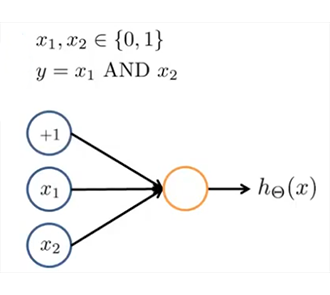
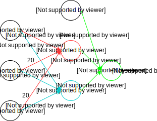
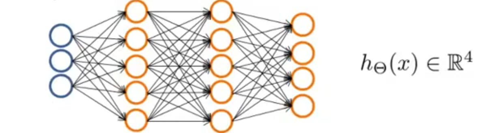

# Neural Network

## Introduction

在之前，我们提到了多项式回归，当我们的特征数不断增加的时候，我们所需要的计算量将会阶乘式的增长，假设我们有100个特征值，我们只考虑他们的二次项，那也会有约5000种选择，这样的计算量是不可忍受的。为了有效地处理这类问题，我们可以使用神经网络（Neural Network）

---

## Model Representation

神经网络算法的模型和人脑的神经元类似：

一个简单的神经网络模型如上图所示，分为Input Layer（第一层）, Hidden Layer（中间所有层）, Output Layer（最后一层），一般来说每次层都会有一个bias unit（固定为1）
我们用$a_i^{(j)}$来表示第$j$层的第$i$个单元，用$\Theta^{(j)}$表示控制第$j$层到第$j+1$层的参数矩阵，用$g(x)$表示我们的激活函数（Sigmoid function）于是在上图的模型中，我们有如下等式：
$$
    \begin{aligned}
        &a_1^{(2)}=g(\Theta_{10}^{(1)}x_0+\Theta_{11}^{(1)}x_1+\Theta_{12}^{(1)}x_2+\Theta_{13}^{(1)}x_3) \\
        &a_2^{(2)}=g(\Theta_{20}^{(1)}x_0+\Theta_{21}^{(1)}x_1+\Theta_{22}^{(1)}x_2+\Theta_{23}^{(1)}x_3) \\
        &a_3^{(2)}=g(\Theta_{30}^{(1)}x_0+\Theta_{31}^{(1)}x_1+\Theta_{32}^{(1)}x_2+\Theta_{33}^{(1)}x_3) \\
        &h_\Theta(x)=a_1^{(3)}=g(\Theta_{10}^{(2)}a_0^{(2)}+\Theta_{11}^{(2)}a_1^{(2)}+\Theta_{13}^{(2)}a_3^{(2)}+\Theta_{13}^{(2)}a_3^{(2)})
    \end{aligned}
$$
上述等式可以用矩阵来表示：
$$
    \begin{aligned}
        &z^{(2)}=\Theta^{(1)}x \\
        &a^{(2)}=g(z^{(2)})
    \end{aligned}
$$
一般的，我们在神经网络中从$j$层到$j+1$层有如下的形式：
$$
    \begin{aligned}
        &Add:a_0^{(j)}=0 \\
        &z^{(j+1)}=\Theta^{(j)}a^{(j)} \\
        &a^{(j+1)}=g(z^{(j+1)})
    \end{aligned}
$$
这个过程被称为神经网络的前向传播（forward propagation）。
如果我们只看Layer2到Layer3的这个过程，不难发现这个过程和Logistic Regression类似，它对特征值$a_0^{(2)},a_1^{(2)},a_2^{(2)},a_3^{(2)}$进行线性组合，然后经过激活函数，对我们的$h_\Theta(x)$做一个估计。神经网络没有对输入层的特征值进行逻辑回归，而是对自己生成的特征值进行回归，这也就意味着我们可以通过参数矩阵来形成一些比较高级、复杂的特征值使用。

### Example

下面给出利用神经网络模型实现一些非线性函数的例子：
首先我们需要实现一个AND函数：

	

我们的权重矩阵可以设为：
$$
    \Theta^{(1)}=(-30,20,20)
$$
这样对应的结果是（$g(4.6)\approx0.99,g(-4.6)\approx0.01$）：

$x_1$|$x_2$|$h_\Theta(x)$
:-:|:-:|:-:
0|0|$g(-30)\approx0$
0|1|$g(-10)\approx0$
1|0|$g(-10)\approx0$
1|1|$g(10)\approx1$

如果我们要实现一个OR函数的话，可以让$\Theta^{(1)}=(-10,20,20)$

$x_1$|$x_2$|$h_\Theta(x)$
:-:|:-:|:-:
0|0|$g(-10)\approx0$
0|1|$g(10)\approx1$
1|0|$g(10)\approx1$
1|1|$g(30)\approx1$

实现NOT函数时，只需要一个特征值，参数矩阵设置为$\Theta^{(1)}=(10,-20)$

$x_1$|$h_\Theta(x)$
:-:|:-:
0|$g(10)\approx1$
1|$g(-10)\approx0$

如果要实现$y=\overline{x}_1\wedge\overline{x}_2$，则可以令权重矩阵为$\Theta^{(1)}=(10,-20,-20)$

$x_1$|$x_2$|$h_\Theta(x)$
:-:|:-:|:-:
0|0|$g(10)\approx1$
0|1|$g(-10)\approx0$
1|0|$g(-10)\approx0$
1|1|$g(-30)\approx0$

如果我们需要实现XNOR的话，注意到$x_1\odot{x_2}=(x_1\wedge{x_2})\vee(\overline{x}_1\wedge\overline{x}_2))$，在这里我们可以使用多层神经网络，先分别实现$x_1\wedge{x_2}$和$\overline{x}_1\wedge\overline{x}_2$，再用or进行组合：

    

真值表如下：

$x_1$|$x_2$|$a_1^{(2)}$|$a_2^{(2)}$|$h_\Theta(x)$
:-:|:-:|:-:|:-:|:-:
0|0|0|1|1
0|1|0|0|1
1|0|0|0|1
1|1|1|0|1

### Multiclass Classification

和在logistic regression中介绍的类似，在神经网络中，我们可以使用这样的方法解决多分类问题。
假设我们要处理一个四分类的问题，在之前我们会把$y$赋值为1,2,3,4表示四种不同的类别，在神经网络中，我们更倾向于用向量$(1,0,0,0)^T,$$(0,1,0,0)^T,...,(0,0,0,1)^T$来表示四种分类，也就是说，我们的输出层存在四个输出：

---

## Learning

回顾Logistic Regression的cost function：
$$
    \begin{aligned}
        J(\theta)=&-\frac{1}{m}[\sum_{i=1}^m(y^{(i)}\log{h_\theta(x^{(i)})}+(1-y^{(i)})\log(1-h_\theta(x^{(i)}))] \\
        &+\frac{\lambda}{2m}\sum_{j=1}^n\theta_j^2
    \end{aligned}
$$
因为实际上神经网络就是多层的逻辑回归，所以神经网络的cost function可以表示为：
$$
    \begin{gathered}
        h_\Theta(x)\in{\mathbb{R}^k}\space{(h_\Theta(x))_i}\triangleq{i^{th}}\space{\text{output}} \\
        \begin{aligned}
            J(\Theta)=&-\frac{1}{m}[\sum_{i=1}^m\sum_{k=1}^Ky^{(i)}\log(h_\theta(x^{(i)}))_k+(1-y^{(i)})\log(1-(h_\theta(x^{(i)}))_k))] \\
            &+\frac{\lambda}{2m}\sum_{l=1}^{L-1}\sum_{i=1}^{s_l}\sum_{j=1}^{s_{l+1}}(\Theta_{ji}^{(l)})^2
        \end{aligned}
    \end{gathered}
$$
问题是如何让这个cost function最小化，依照惯例我们使用梯度下降算法。

### Backpropagation Algorithm

为了使用梯度下降算法实现$\argmin\limits_\Theta{J(\Theta)}$，我们需要计算$J(\Theta)$和$\dfrac{\partial}{\partial{\Theta_{ij}^{(l)}}}J(\Theta)$，这里用到的算法就是backpropagation algorithm.
我们定义$l$层第$j$个节点的误差为：
$$
    \begin{gathered}
        \delta_j^{(l)}=\frac{\partial}{\partial{z_j^{(l)}}}cost(i) \\
        cost(i)=-(y^{(i)}\log{h_\theta(x^{(i)})}+(1-y^{(i)})\log(1-h_\theta(x^{(i)}))
    \end{gathered}
$$
对于输出层，我们有：
$$
    \delta_j^{(L)}=\frac{\partial}{\partial{z_j^{(L)}}}cost(i)=\sum_{k=1}^K\frac{\partial}{\partial{a_k^{(L)}}}cost(i)\cdot\frac{\partial{a_k^{(L)}}}{\partial{z_j^{(L)}}}
$$
因为第$j$个节点的误差和其他节点无关，所以有：
$$
    \begin{aligned}
        \delta_j^{(L)}&=\frac{\partial}{\partial{a_j^{(L)}}}cost(i)\cdot\frac{\partial{a_j^{(L)}}}{\partial{z_j^{(L)}}} \\
        &=-(\frac{y_j}{a_j^{(L)}}-\frac{1-y_j}{1-a_j^{(L)}})\cdot{a_j^{(L)}}(1-a_j^{(L)}) \\
        &=a_j^{(L)}-y_j
    \end{aligned}
$$
用向量表示就是：
$$
    \delta^{(L)}=a^{(L)}-y
$$
同样的，对于隐藏层我们可以推导出：
$$
    \delta^{(l)}=(\Theta^{(l)})^T\delta^{(l+1)}.*g'(z^{(l)})
$$
于是我们得到了backpropagation算法：

&emsp;Set $\Delta_{ij}^{(l)}=0$ (for all $i,j,l$).
&emsp;For $i=1$ to $m$
&emsp;&emsp;Set $a^{(1)}=x^{(i)}$
&emsp;&emsp;Perform forward propagation to compute $a^{(l)}$ for $l=2,3,...,L$
&emsp;&emsp;Using $y^{(i)}$ to compute $\delta^{(L)}=a^{(L)}-y^{(i)}$
&emsp;&emsp;Compute $\delta^{(L-1)},\delta^{(L-2)},...,\delta^{(2)}$
&emsp;&emsp;$\Delta_{ij}^{l}:=\Delta_{ij}^{l}+a_j^{(l)}\delta_i^{(l+1)}$
&emsp;$D_{ij}^{(l)}=\frac{1}{m}\Delta_{ij}^{l}+\lambda\Theta_{ij}^{(l)},\space{if\space}j\neq0$
&emsp;$D_{ij}^{(l)}=\frac{1}{m}\Delta_{ij}^{l},\space{if\space}j=0$

其中$D_{ij}^{(l)}$即我们想要计算的$\dfrac{\partial}{\partial{\Theta_{ij}^{(l)}}}J(\Theta)$

---

## Gradient Checking

在实际操作中，我们需要检验我们的backpropagation算法是否正确，这时候需要进行梯度检验，梯度检验的核心思想就是去用，导数估计值和我们得出的偏导数相比较，在数值计算中，有一种比较常用的导数值估计的方法：
$$
    f'(x)=\dfrac{f(x+\epsilon)-f(x-\epsilon)}{2\epsilon}
$$
一般来说，我们取$\epsilon\approx10^{-4}$，我们需要检查的是$D_{ij}^{(l)}$是否和我们估算出来的导数值相近。需要注意的是，如果我们验证好了我们算法的正确性，我们应该关闭梯度检验，否则代码的运行速度将大幅减慢。

---

## Random Initialization

在实现神经网络算法的时候，如果我们把权重矩阵预设为0的话，实际上我们并不能得到很好的结果，因为神经网络会出现高度的冗余，很多神经元会计算相同的内容，为了避免这样的情况，我们需要对权重矩阵进行随机赋值，使得$\forall{i,j,l},-\epsilon\leq\Theta_{ij}^{(l)}\leq\epsilon$（$\epsilon$为接近0的一个小量）
