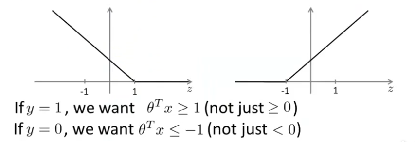
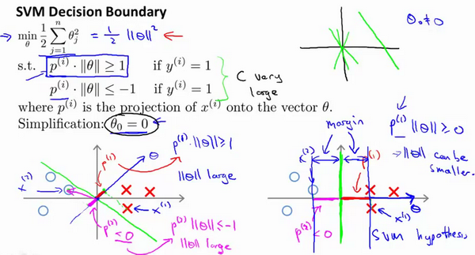
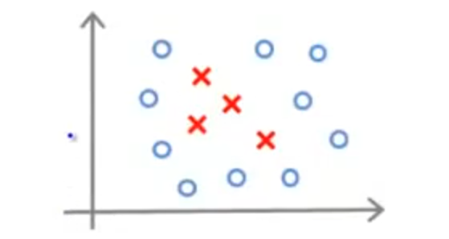

# Support Vector Machine

## Introduction

SVM是一种广泛应用的分类算法，SVM有三个要点：Hard-Margin, Soft-Margin, Kernel。
SVM希望找到一个最好的分类的超平面，离所有的点间隔都最大。

### Hard-Margin

硬间隔SVM又称为最大间隔分类器。它需要：
$$
    \max\text{margin}(W,b)\space{}s.t.\space{}y_i(W^Tx_i+b)>0
$$
这里的数据集是：
$$
    \{(x_i,y_i)\}_{i=1}^N,x_i\in\mathbb{R}^p,y_i\in\{-1,1\}
$$
我们选取$f(W)=sign(W^Tx+b)$为激活函数。
根据定义，我们可以得出：
$$
    margin(W,b)=\min_{W,b,i=1,\cdots,N}\text{distance}(W,b,x_i)=\min_{W,b,i=1,\cdots,N}\dfrac{y_i(W^Tx_i+b)}{\parallel{W}\parallel}
$$
我们的问题可以由此转换为：
$$
    \left\{
        \begin{array}{lr}
            \max\limits_{W,b}\dfrac{\min\limits_{i=1,\cdots,N}y_i(W^Tx_i+b)}{\parallel{W}\parallel} \\
            \\
            s.t.\space{}y_i(W^Tx_i+b)>0
        \end{array}
    \right.
$$
通过对$W$进行缩放，我们可以使得$\min\limits_{i=1,\cdots,N}y_i(W^Tx_i+b)$为$1$，因此：
$$
    \begin{aligned}
        &\left\{
        \begin{array}{lr}
            \max\limits_{W,b}\dfrac{1}{\parallel{W}\parallel} \\
            \\
            s.t.\space{}\forall{i=1,\cdots,N}\space{}y_i(W^Tx_i+b)\geq1
        \end{array}
        \right. \\
        \Rightarrow
        &\left\{
        \begin{array}{lr}
            \min\limits_{W,b}\frac{1}{2}W^TW \\
            \\
            s.t.\space{}\forall{i=1,\cdots,N},\space{}1-y_i(W^Tx_i+b)\leq0
        \end{array}
        \right. \\
    \end{aligned}
$$
这样就转换为一个convex optimization（凸优化）问题，优化函数为二次函数。我们可以用拉格朗日乘子法解决。
$$
    \begin{aligned}
        &\mathcal{L}(W,b,\lambda)=\frac{1}{2}W^TW+\sum_{i=1}^N\lambda_i(1-y_i(W^Tx_i+b)) \\
        &\left\{
        \begin{array}{lr}
            \min\limits_{W,b}\max\limits_{\lambda}\mathcal{L}(W,b,\lambda) \\
            \\
            s.t.\space{}\forall{i=1,\cdots,N},\space\lambda_i\geq0
        \end{array}
        \right.
    \end{aligned}
$$
这个问题的转换我们可以这样理解，当$1-y_i(W^Tx_i+b)\geq0$时，$\max\limits_{\lambda}\mathcal{L}(W,b,\lambda)=+\infin$，当$1-y_i(W^Tx_i+b)<0$时，$\max\limits_{\lambda}\mathcal{L}(W,b,\lambda)$必然存在最大值$\frac{1}{2}W^TW$，则$\min\limits_{W,b}\max\limits_{\lambda}\mathcal{L}(W,b,\lambda)$可以在$1-y_i(W^Tx_i+b)<0$时找到。因此这两个是等价的。
由于这是一种凸二次优化问题，所以这个问题和它的对偶问题(dual problem)等价：
$$
    \left\{
    \begin{array}{lr}
            \max\limits_{\lambda}\min\limits_{W,b}\mathcal{L}(W,b,\lambda) \\
            \\
            s.t.\space{}\forall{i=1,\cdots,N},\space\lambda_i\geq0
        \end{array}
    \right.
$$
因此，
$$
    \begin{aligned}
        &\dfrac{\partial{\mathcal{L}}}{\partial{b}}=-\sum_{i=1}^N\lambda_iy_i=0 \\
        \Rightarrow&\mathcal{L}(W,b,\lambda)=\frac{1}{2}W^TW+\sum_{i=1}^N\lambda_i-\sum_{i=1}^N\lambda_iy_iW^Tx_i \\
        &\dfrac{\partial{\mathcal{L}}}{\partial{W}}=W-\sum_{i=1}^N\lambda_iy_ix_i=0 \\
        \Rightarrow&
        \begin{aligned}
            \mathcal{L}(W,b,\lambda)&=\frac{1}{2}(\sum_{i=1}^N\lambda_iy_ix_i)^T\sum_{j=1}^N\lambda_jy_jx_j-\sum_{i=1}^N\lambda_i(y_i(\sum_{j=1}^N\lambda_jy_jx_j)^Tx_i-1) \\
            &=-\frac{1}{2}\sum_{i=1}^N\sum_{j=1}^N\lambda_i\lambda_jy_iy_jx_i^Tx_j+\sum_{i=1}^N\lambda_i
        \end{aligned}
    \end{aligned}
$$
问题转换为（为QP，有现成工具求解）：
$$
    \left\{
    \begin{array}{lr}
            \min\limits_{\lambda}\frac{1}{2}\sum_{i=1}^N\sum_{j=1}^N\lambda_i\lambda_jy_iy_jx_i^Tx_j-\sum_{i=1}^N\lambda_i \\
            \\
            s.t.\space{}\lambda_i\geq0 \\
            \\
            \sum_{i=1}^N\lambda_iy_i=0
        \end{array}
    \right.
$$
因为原、对偶问题具有强对偶关系，等价于它们满足KKT条件：
$$
    \left\{
        \begin{array}{lr}
            \dfrac{\partial{\mathcal{L}}}{\partial{b}}=0,\space{}\dfrac{\partial{\mathcal{L}}}{\partial{W}}=0 \\
            \\
            \lambda_i(1-y_i(W^Tx_i+b))=0 \\
            \\
            \lambda_i\geq0 \\
            \\
            1-y_i(W^Tx_i+b)\leq0
        \end{array}
    \right.
$$
观察后三个条件我们可以得出，当数据不在支持向量$W^Tx+b=\pm1$上时，有$\lambda_i=0$。我们假设$\exist(x_k,y_k),\space{s.t.}\space{}1-y_k(W^Tx_k+b)=0$。那么：
$$
    \begin{aligned}
        &y_k(W^Tx_k+b)=1 \\
        \Rightarrow&y_k^2(W^Tx_k+b)=y_k \\
        \Rightarrow&(W^Tx_k+b)=y_k \\
        \Rightarrow&b^*=y_k-W^Tx_k
    \end{aligned}
$$
因此，我们可以解出$W,b$：
$$
    \left\{
        \begin{array}{lr}
            W^*=\sum_{i=1}^N\lambda_iy_ix_i \\
            \\
            b^*=y_k-\sum_{i=1}^N\lambda_iy_ix_i^Tx_k
        \end{array}
    \right.
$$

### Soft-Margin

#### $f(W)=sign(W^Tx+b)$

软间隔SVM产生的初衷是允许我们的分类产生一点点错误，我们回到我们最初的优化问题：
$$
    \left\{
        \begin{array}{lr}
            \min\limits_{W,b}\frac{1}{2}W^TW \\
            \\
            s.t.\space{}\forall{i=1,\cdots,N},\space{}1-y_i(W^Tx_i+b)\leq0
        \end{array}
    \right.
$$
我们需要在此基础上对优化函数做出一些改动，加上一个loss function。对于这个loss function，最简单的想法就是发生错误点的个数$\sum_{i=1}^NI\{y_i(W^Tx_i+b)<1\}$，但是这是一个不连续的函数，更好的选择是$loss=\max\{0,1-y_i(W^Tx_i+b)\}$。引入变量$\xi_i=1-y_i(W^Tx_i+b)$，且$\xi_i\geq0$，那么优化问题可以转换为：
$$
    \left\{
        \begin{array}{lr}
            \min\limits_{W,b}\frac{1}{2}W^TW+C\sum_{i=1}^N\xi_i \\
            \\
            s.t.\space{}y_i(W^Tx_i+b)\geq1-\xi_i,\space{\xi_i\geq0}
        \end{array}
    \right.
$$
这个问题和上一节的解法类似，在这里不多做介绍。

---

#### $f(W)=sigmoid(\theta^Tx)$

回忆之前的逻辑回归，为了得到更好地分类效果，我们希望：
$$
    \begin{aligned}
        &if\space{y=1},\space{we}\space{want}\space{h_\theta(x)\approx1,}\space{\theta^Tx\gg0} \\
        &if\space{y=0},\space{we}\space{want}\space{h_\theta(x)\approx0,}\space{\theta^Tx\ll0}
    \end{aligned}
$$
回忆我们在逻辑回归中提出的cost function：
$$
    \begin{aligned}
        &-(y\log{h_\theta(x)}+(1-y)\log(1-h_\theta(x)) \\
        =&-(y\log{\dfrac{1}{1+e^{-\theta^Tx}}}+(1-y)\log(1-\dfrac{1}{1+e^{-\theta^Tx}})
    \end{aligned}
$$
我们把$\log{h_\theta(x)}$转换成折线$cost(z)$

因此我们的优化函数便转换成了（$C$可以理解为$\dfrac{1}{\lambda}$）：
$$
    \min_\theta{C\sum_{i=1}^m[y^{(i)}cost_1(\theta^Tx^{(i)})+(1-y^{(i)})cost_0(\theta^Tx^{(i)})]}+\frac{1}{2}\sum_{j=1}^n\theta_j^2
$$
当C较大时，我们可以忽略优化函数的的第一项。我们对$\theta^Tx$做一个转换，$\theta^Tx$可以视作向量$\theta$和$x$的内积，我们设$x^{(i)}$在$\theta$上的投影为$p^{(i)}$，那么$\theta^Tx=p^{(i)}\cdot\parallel\theta\parallel$。我们对分类器做一个简单的理解：

对于如下的数据集，如果我们用左图进行分类的话，那么我们得到的$p^{(i)}$会很小，如果要做到$|p^{(i)}\cdot\parallel\theta\parallel|\gg1$的话，那么我们需要让$\parallel\theta\parallel$充分大，这样就无法使得我们的目标函数尽可能地小，如果使用右图的分类方法的话，那么就可以满足我们的优化条件。因此SVM产生的是大间隔的分类器。

---

### Kernel Method

我们从线性分类这个问题开始讲起，依据数据的特点我们可以采用不同的算法：

线性可分|一点点错误|严格线性不可分
:-:|:-:|:-:
PLA|Pocket Algorithm|φ(x)+PLA/NN/DL
Hard-Margin SVM|Soft-Margin SVM|Kernel SVM

为了处理严格线性不可分的问题，一种想法是使用多层感知机（神经网络）、深度学习算法；另一种则是把这个问题转换成线性可分问题，根据Cover Theorem，高维空间比低维空间更容易线性可分，我们需要一个非线性的映射，把我们的原问题转换为高维问题。
回忆之前我们对问题的处理，我们先是将其转换为了一个凸优化问题：
$$
    \left\{
        \begin{array}{lr}
            \min\limits_{W,b}\frac{1}{2}W^TW \\
            \\
            s.t.\space{}\forall{i=1,\cdots,N},\space{}1-y_i(W^Tx_i+b)\leq0
        \end{array}
    \right.
$$
然后演变成了求解它的对偶问题：
$$
    \left\{
    \begin{array}{lr}
            \min\limits_{\lambda}\frac{1}{2}\sum_{i=1}^N\sum_{j=1}^N\lambda_i\lambda_jy_iy_jx_i^Tx_j-\sum_{i=1}^N\lambda_i \\
            \\
            s.t.\space{}\lambda_i\geq0 \\
            \\
            \sum_{i=1}^N\lambda_iy_i=0
        \end{array}
    \right.
$$
问题中的$x_i^Tx_j$我们可以理解为两个向量的内积，那么经过我们的映射，这就会变成$\phi(x_i)^T\phi(x_j)$，问题在于映射之后得到的$\phi(x)$维数很高甚至是无限维的，我们在得到$\phi(x)$的基础上还要计算内积，计算量难以接受，这时候就有一个想法，我们能否找到一个函数$\mathcal{K}(x,x')$它的值就是$\phi(x)^T\phi(x')$？
从这一点出发，我们可以引出核函数(Kernel Function)的定义：
$$
    \forall{x},x'\in\mathcal{X},\exist\phi:\mathcal{X}\mapsto\mathcal{Z},\phi\in\mathcal{H},s.t.\space{\mathcal{K}}(x,x')=\phi(x)^T\phi(x')
$$
这里的$\mathcal{H}$指的是$Hilbert\space{space}$，它是完备的、可能是无限维的、被赋予内积的线性空间。
这样的核函数又叫正定核函数，它满足如下两条性质：
$$
    \begin{aligned}
        &symmetric:\space\mathcal{K}(x,z)=\mathcal{K}(z,x) \\
        &\begin{aligned}
            positive\space{definite}:\space\forall{x_1},x_2,\cdots,x_N\in\mathcal{X},K=[K(x_i,x_j)]& \\
            (Gram\space{Matrix})\space{is}\space{positive}\space{semi-definite}&
        \end{aligned}
    \end{aligned}
$$
一个常见的核函数是：
$$
    \mathcal{K}(x,z)=\exp(-\dfrac{\parallel{x-z}\parallel^2}{2\sigma^2})
$$
它又被称为“高斯核函数(Gauss Kernel Function)”，我们举一个例子来应用这个核函数。
假设我们的数据集为：
$$
    \{(x_i,y_i)\}_{i=1}^m,x_i\in\mathbb{R}^p,y_i\in\{0,1\}
$$
它的分布如下图所示：

很显然这不是一个线性可分的例子，在学习核函数之前，我们处理这样的问题可能会采用多项式回归的方法，即加入一些高次项作为特征值，但是在核函数当中，我们将会采取不一样的方法。我们把这些数据点记作$l^{(i)}$，我们定义特征值$f^{(i)}=\mathcal{K}(x,l^{(i)})(i\geq1,f^{(0)}=1)$
那么SVM with Kernel可以表示为：
$$
    \begin{aligned}
        &\begin{aligned}
            Hyp&othesis:\space{Given}\space{x},\space{compute}\space{features}\space{f\in\mathbb{R}^{m+1}} \\
            &Predict\space{y=1,}\space{if}\space{\theta^Tf\geq0}
        \end{aligned} \\
        &\begin{aligned}
            Tra&ining: \\
            &\min_\theta{C\sum_{i=1}^m[y^{(i)}cost_1(\theta^Tf^{(i)})+(1-y^{(i)})cost_0(\theta^Tf^{(i)})]}+\frac{1}{2}\sum_{j=1}^m\theta_j^2
        \end{aligned}
    \end{aligned}
$$
