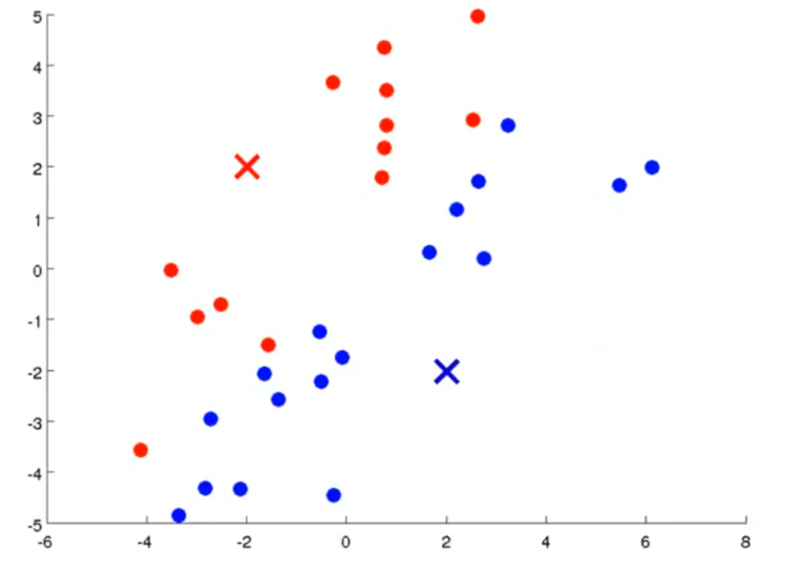
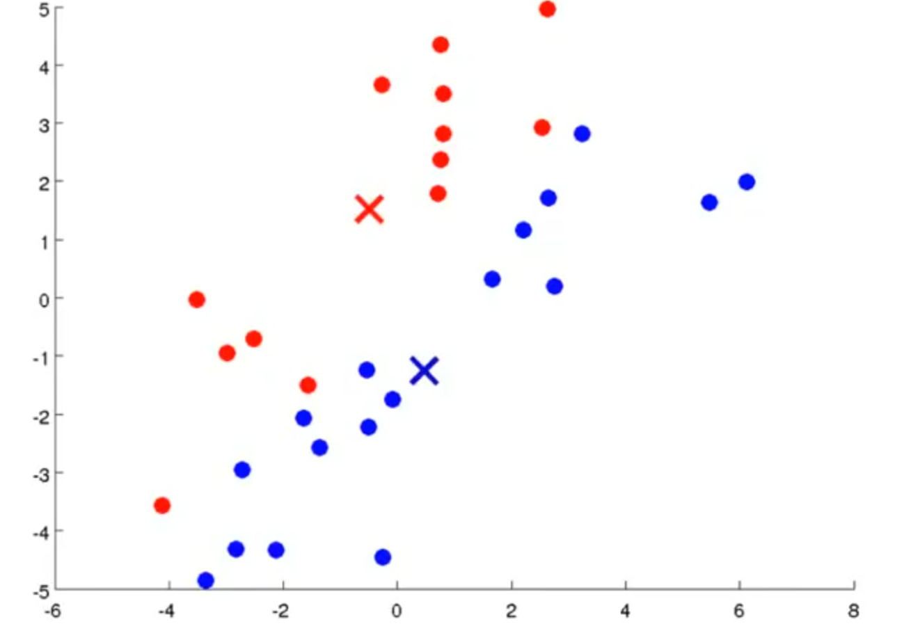
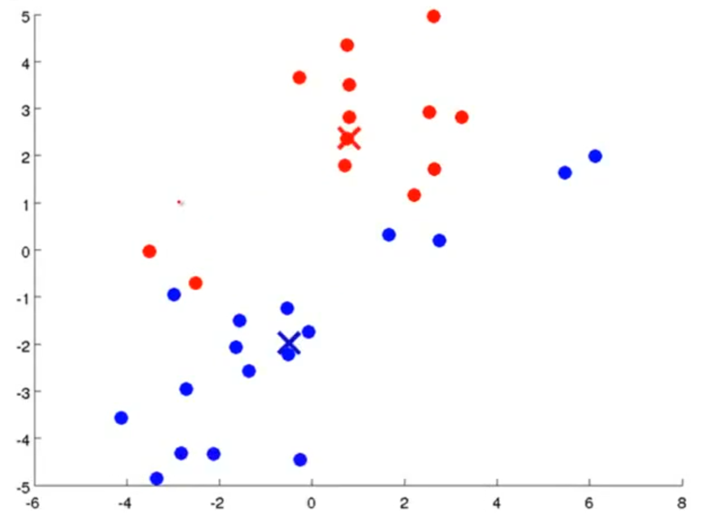
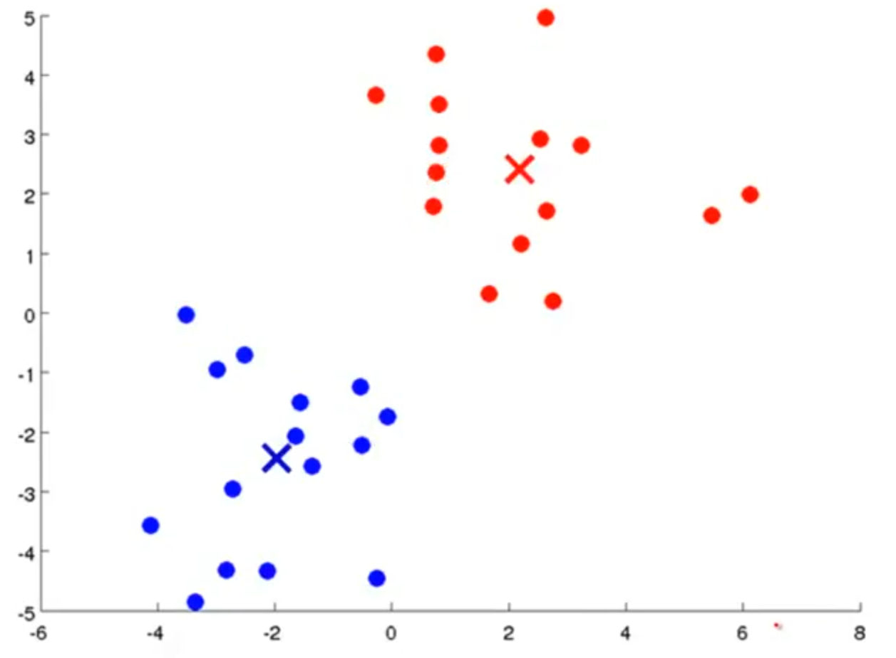
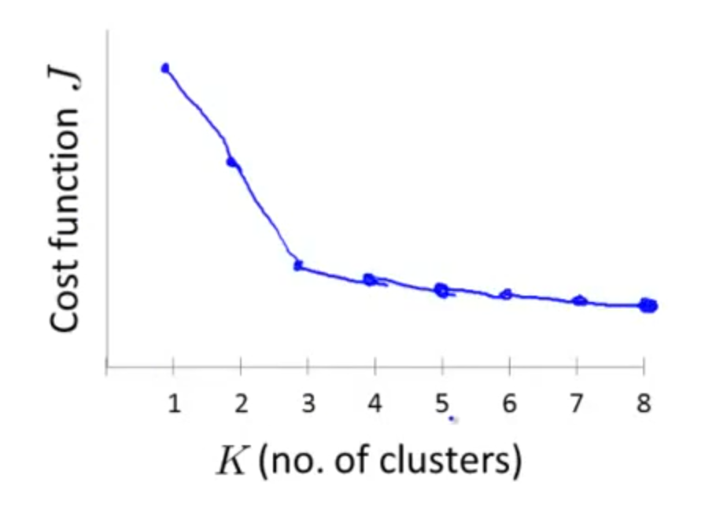
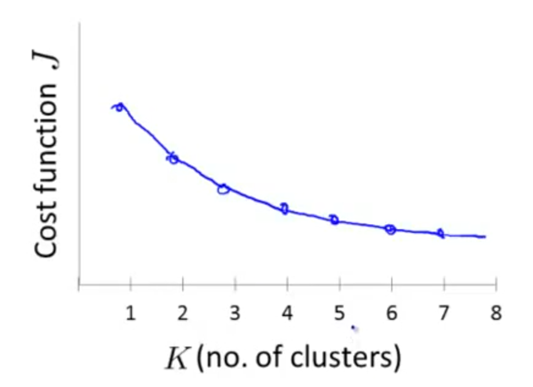

# Clustering

## Introduction

在之前我们介绍了很多监督学习的算法，下面介绍一些无监督学习的算法，监督学习和无监督学习的区别在于，数据是否有被标注，比如在分类问题中，监督学习时我们对数据集是已经有分类的，但是在无监督学习中，每一个数据都没有被分类（即没有$y$），如下图所示：

我们需要做的是，把这些数据输入到一个算法中，让算法对我们的数据进行分类。

## K-Means Algorithm

一个常用的无监督学习的迭代算法是K-Means，它是最普及的聚类算法。
在算法中，我们首先要随机选取K个点作为我们的聚类中心，然后把所有的数据点和离它最近的那个聚类中心关联起来，接下来我们需要移动聚类中心到和它所有关联点的中心，接下来重复上述步骤直至算法收敛。

```persudo code
Randomly initialize K cluster centroids μ1,μ2,...,μK
Repeat {
    for i = 1 to m
        c(i) := index (from 1 to K) of cluster centroid closest to x(i)
    for k = 1 to K
        μk := average (mean) of points assigned to cluster k
}
```

我们举一个例子，我们有如下数据集，随机选取两个点作为聚类中心（Cluster Centroid）：

根据这两个聚类中心，我们把数据进行分类（分成红色和蓝色，这一步又称为Cluster Assignment Step）:

第二步（Move Centroid Step）需要把聚类中心移到各自类的中心：

接下来重复上述步骤，我们的聚类中心的位置会逐渐收敛：


我们用$\mu_{c^{(i)}}$来表示$x^{(i)}$属于的那个聚类中心，那么我们的cost function就可以表示为：
$$
    J(c^{(1)},\cdots,c^{(m)},\mu_1,\cdots,\mu_K)=\frac{1}{m}\sum_{i=1}^m\parallel{x^{(i)}-\mu_{c^{(i)}}}\parallel^2
$$
我们需要使得这个cost funtion（又称distortion function）最小。
需要注意的是，随机生成聚类中心的方法，不同的聚类中心可能会导致我们的算法收敛到不同的局部最优点，一个比较好的随机生成方法是随机选取数据集中的K个点作为我们的聚类中心，同时我们需要多次选择聚类中心，来保证我们的算法收敛到全局最优。
在K-Means中，还有一个问题在于聚类中心数量K的选取，对于这一个问题我们有一种Elbow Method可以给我们一些参考。假设我们得到了一条J-K的曲线：

这样的曲线和Elbow（肘部）类似，我们发现K=3就是“手肘”的部分，所以在这种情况下，选择K=3是一种比较好的选择。然而，Elbow Method也存在其局限性，对于一些模棱两可的曲线我们很难这样直观地去判断K的取值：

一般来说，在无监督学习当中，K的选取是一般是没有最优的答案的，我们需要做的是考虑K的实际意义，根据经验来选取K的值。
