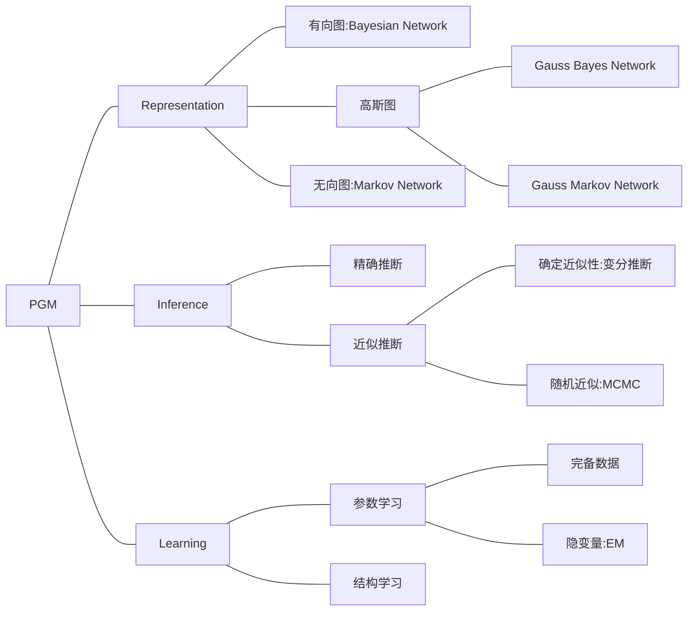
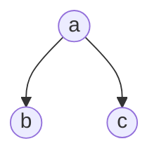
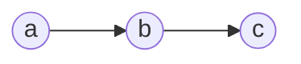
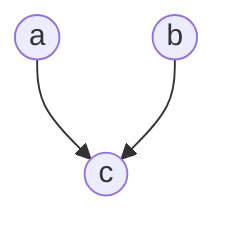
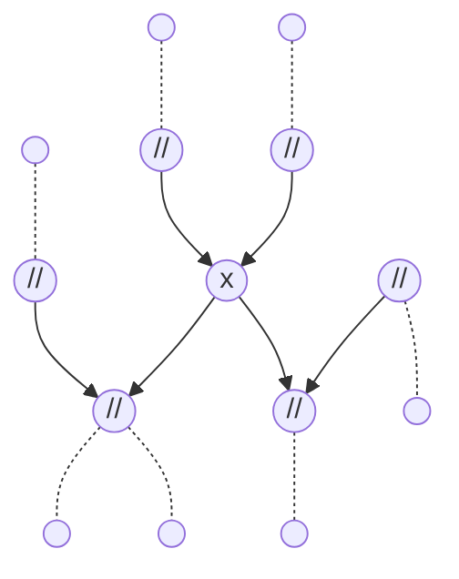
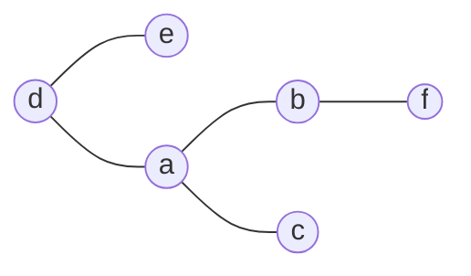
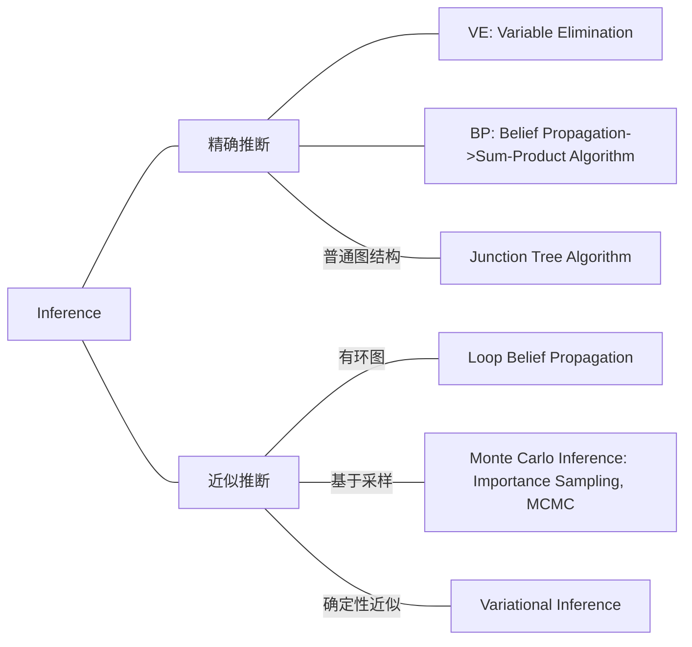
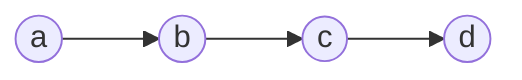
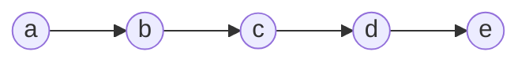
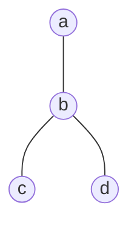

# PGM

## Framework



## Background

​	在知道了一个高维随机变量$f(x_1,x_2,\cdots,x_p)$之后，我们可以计算它的边缘概率$P(x_i)$和条件概率$P(x_j|x_i)$.这些计算遵循以下法则（前两个以2维为例）：
$$
\begin{aligned}
	&\text{1. Sum Rule: }&&P(x_1)=\int{P(x_1,x_2)dx_2} \\
	&\text{2. Product Rule: }&&P(x_1,x_2)=P(x_2)\cdot{P}(x_1|x_2)=P(x_1)\cdot{P}(x_2|x_1) \\
	&\text{3. Chain Rule: }
	&&P(x_1,x_2,\cdots,x_p)=\prod_{x=1}^pP(x_i|x_1,x_2,\cdots,x_{i-1}) \\
	&\text{4. Bayesian Rule:}&&P(x_2|x_1)=\dfrac{P(x_1,x_2)}{P(x_1)}=\dfrac{P(x_2)\cdot{P(x_1|x_2)}}{\int{P(x_2)\cdot{P}(x_1|x_2)dx_2}}
	 \\
\end{aligned}
$$
​	在维度高的情况下，这样的计算会变得非常复杂，特别是联合概率$P(x_1,x_2,\cdots,x_p)$的计算量特别巨大。因此我们需要进行一些简化：

​	一个简单的想法就是假设各个维度相互独立，在此情况下$P(x_1,x_2,\cdots,x_p)=\prod_{i=1}^pP(x_i)$，这样的假设被应用在Naïve Bayes中：
$$
P(\mathbf{X}|y)=\prod_{i=1}^pP(x_i|y)
$$
​	这样的条件过于强，因此对其进行放松就有了另一种简化想法，Markov性质。 一阶的Markov性质表明，在给定现在的情况下，将来与过去独立：
$$
\forall{j<i}, x_j\perp{x_{i+1}}|x_i
$$
 	进一步放松，引出条件独立性假设：
$$
x_A\perp{x_B}|x_C,\space{x_A,x_B,x_C}\text{是互不相交的集合}
$$
​	这是概率图模型的**核心概念**。

## Bayesian Network

​	Bayesian Network是以有向图的形式构建的概率图模型，我们可以根据图直观地写出联合概率的分布，如在此同父结构当中：



​	利用因子分解法则：
$$
	P(x_1,x_2,\cdots,x_p)=\prod_{i=1}^pP(x_i|x_{parent(i)})
$$
​	我们可以得到联合概率
$$
	P(a,b,c)=P(a)\cdot{P(b|a)}\cdot{P(c|a)}
$$
​	又因为存在链式法则，所以
$$
	P(a,b,c)=P(a)\cdot{P(b|a)}\cdot{P(c|a,b)}
$$
​	因此有
$$
	P(c|a)=P(c|a,b)
$$
​	即
$$
c\perp{b}|a
$$
 	在此结构下，如果给定$a$那么$b,c$独立。

​	同理可得，在如下的顺序结构中



​	有$a\perp{c}|b$。

​	在以下的V字型结构中，默认情况下，如果$c$未被观测，$a,b$独立。$P(a,b,c)=P(a)\cdot{P(b)}\cdot{P(c|a,b)}$$=P(a)\cdot{P(b|a)}\cdot{P(c|a,b)}$，即$P(b|a)=P(b)$.



​	$c$被观测之后，$a,b$不独立。在这种情况下，如果$c$的后继$d$被观测，那么同样可以得到$a,b$独立。

​	依托以上3种局部结构，我们可以得出判断有向图是否具备条件独立性的方法D-Separation。判断规则有以下两条：

​	对于三个互不相交的随机变量的集合$x_A,x_B,x_C$，我们假设这三个集合满足顺序结构，即$x_A\rightarrow{x_B}\rightarrow{x_C}$.那么有
$$
\begin{aligned}
	&\text{Rule1: }\forall{x\in{x}_A},y\in{x_C}\text{, if }\exist{z}\text{ s.t. }x\rightarrow{z}\rightarrow{y}\text{, then }z\in{x_B}. \\
	&\text{Rule2: }\forall{x\in{x}_A},y\in{x_C}\text{, if }\exist{z}\text{ s.t. }x\rightarrow{z}\text{, }y\rightarrow{z}\text{, then }z\text{ and child}(z)\notin{x_B}.
\end{aligned}
$$
​	那么，则称$x_A$和$x_C$关于$x_B$独立，具有全局Markov性。

​	考虑如下条件概率$P(x_i|x_{-i})$，其中$x_{-i}$表示除去$x_i$以外的所有维度，由贝叶斯定理，可得
$$
P(x_i|x_{-i})=\dfrac{P(x_i,x_{-i})}{P(x_{-i})}=\dfrac{P(\mathbf{x})}{\int_{x_i}P(\mathbf{x})dx_i}
$$
​	带入因子分解
$$
P(x_i|x_{-i})=\dfrac{\prod_{j=1}^pP(x_j|x_{parent(j)})}{\int_{x_i}\prod_{j=1}^pP(x_j|x_{parent(j)})dx_i}
$$
​	把连乘项分为与$x_i$的有关项$\overline{\Delta}$和无关项$\Delta$，那么有
$$
	P(x_i|x_{-i})=\dfrac{\Delta\cdot\overline{\Delta}}{\Delta\int_{x_i}\overline{\Delta}dx_i}=\dfrac{\overline{\Delta}}{\int_{x_i}\overline{\Delta}dx_i}
$$
​	即$x_i$与其他所有点的关系，可以转化为只和$x_i$相关的所有的点的关系。显然，$x_{parent(i)}\text{, }x_{child(i)}$和$x_{parent(child(i))}$和$x_i$相关。例如，在这样复杂的概率图中，只有标上阴影的点和$x$有关。



## Markov Network

​	Markov Network是一个无向图模型，它的条件独立性体现在三个方面
$$
\begin{aligned}
	&\text{1. Global Markov: }&&x_A\perp{x_C}|x_B \\
	&\text{2. Local Markov: }&&a\perp\{U-a-\text{neighbour}(a)\}|\text{neighbour(a)} \\
	&\text{3. 成对Markov: }&&x_i\perp{x_j}|x_{-i-j}\text{, }i\notin\{j\text{ and neighbour}(j)\} \\
\end{aligned}
$$
​	这三个性质实际上是互相等价的，一个关于2的例子如下：



​	在上图中，由性质2，有$a\perp\{e,f\}|\{b,c,d\}$.

​	考虑Markov Network下的因子分解，对此我们需要引入团（Clique）这一概念，一个团即是一个图的完全子图，团中的每个顶点都两两相邻。对于最大团来说，加入任意一个顶点，都会破坏团的性质。我们将Markov Network分为若干个最大团$x_{C_1},x_{C_2},\cdots,x_{C_k}$，定义一个恒正的势函数$\phi$使得
$$
P(\mathbf{x})=\frac{1}{z}\prod_{i=1}^k\phi(x_{C_i})
$$
​	其中$z$为归一化参数，不难发现
$$
z=\sum_{\mathbf{x}}\prod_{i=1}^k\phi(x_{C_i})
$$
​	由Hammersley-Clifford定理可知，此概率分布下满足条件独立性，即和马尔科夫随机场（Markov Random Field，又称Markov Network）对应。为了使$\phi$恒正，我们通常让$\phi(x_{C_i})$表示为$\exp(-E(x_{C_i}))$的形式，其中$E$又称能量函数，在此情况下，我们称$P(\mathbf{x})$服从Gibbs Distribution，又称Boltzmann Distribution.

​	因此，
$$
\begin{aligned}
	P(\mathbf{x})&=\frac{1}{z}\prod_{i=1}^k\phi(x_{C_i}) \\
	&=\frac{1}{z}\prod_{i=1}^k\exp(-E(x_{C_i})) \\
	&=\frac{1}{z}\exp(-\sum_{i=1}^{k}E(x_{C_i})) \\
\end{aligned}
$$
​	满足指数族分布的标准形式
$$
	P(x)=\frac{1}{Z(\eta)}h(x)\exp(\eta^T\phi(x))
$$

## Inference

​	推断主要计算的有以下内容
$$
\begin{aligned}
	&\text{2. 条件概率: }P(x_A|x_B)\text{, }\mathbf{x}=x_A+x_B \\
	&\text{3. MAP Inference: }\hat{z}=argmax_{z}P(z|x)\propto{argmax_z}P(z,x)
\end{aligned}
$$
​	推断可以按照方法分为以下几类



### Variable Elimination

​	假设$a,b,c,d$均是离散的二值变量，考虑如下Markov链，计算$P(d)$



​	不难得出
$$
\begin{aligned}
	P(d)&=\sum_{x_a,x_b,x_c}P(a,b,c,d) \\
	&=\sum_{x_a,x_b,x_c}P(a)P(b|a)P(c|b)P(d|c) \\
\end{aligned}
$$
​	根据$a,b,c$的组合，将有$2^3=8$项，计算的复杂度将随维度的增大而指数增长。因为在一张图中，和任意一个顶点相邻的顶点在一般情况下是很少的，所以我们改变求和的思路：
$$
\begin{aligned}
	P(d)&=\sum_{x_b,x_c}P(c|b)P(d|c)\cdot\sum_{x_a}P(a)P(b|a)\triangleq{m}_{a\rightarrow{b}}(b) \\
	&=\sum_{x_b,x_c}P(c|b)P(d|c)\cdot{m}_{a\rightarrow{b}}(b) \\
	&=\sum_{x_c}P(d|c)\cdot(\sum_{x_b}P(c|b)\cdot{m}_{a\rightarrow{b}}(b))\triangleq{m}_{b\rightarrow{c}}(c) \\
	&={m}_{c\rightarrow{d}}(d)
\end{aligned}
$$
​	利用乘法分配律，我们可以做到以上运算的化简，对于无向图来说，上述简化也依旧成立。这就是VE的核心思想，但是这样的计算方法也有其缺点，第一就是重复计算，如果我们需要计算$P(c)$，则需要重复进行上述的流程，第二点变量消除的次序实际上决定了计算的复杂度，要找到一个最优的计算顺序，则是一个NP-Hard问题。

### Belief Propagation

​	Belief Propagation的引入，是为了解决VE的重复计算问题，我们进一步考虑上一部分的例子，



​	在每一个条边$<i,j>$上都会有一个我们之前提到的函数$m_{i\rightarrow{j}}(j)$，假设我们现在要计算$P(c)$，显然
$$
P(c)=\sum_{x_b,x_a}P(a)P(b|a)P(c|b)\cdot\sum_{x_d,x_e}P(d|c)P(e|d)=m_{b\rightarrow{c}}(c)\cdot\sum_{x_d,x_e}P(d|c)P(e|d)
$$
​	如果我们存储了中间的结果，那么计算的复杂度将会大幅降低。

​	我们将以上结论推广到树中，考虑无向树



​	由因子分解
$$
P(a,b,c,d)=\frac{1}{z}\psi_a(a)\psi_b(b)\psi_c(c)\psi_d(d)\psi_{a,b}(a,b)\psi_{b,c}(b,c)\psi_{c,d}(c,d)
$$
​	因此
$$
\begin{aligned}
	P(a)&=\sum_{x_b,x_c,x_d}P(a,b,c,d) \\
	&=\psi_a\sum_{x_b}\psi_{a,b}\psi_b\sum_{x_c}\psi_c\psi_{b,c}\sum_{x_d}\psi_d\psi_{b,d} \\
	&=\psi_a\sum_{x_b}\psi_{a,b}\psi_bm_{c\rightarrow{b}}(b)m_{d\rightarrow{b}}(b) \\
	&=\psi_{a}m_{b\rightarrow{a}}(a) \\
\end{aligned}
$$
​	更一般的，对于任意节点$i$，有
$$
\left\{
	\begin{aligned}
		&m_{j\rightarrow{i}}(i)=\sum_{x_j}\psi_i\psi_{i,j}\prod_{k\in\text{neighbour}(j)-i}m_{k\rightarrow{j}}(j) \\
		&P(i)=\psi_i\prod_{k\in\text{neighbour}(i)}m_{k\rightarrow{i}}(i)
	\end{aligned}
\right.
$$
​	只需要求所有的$m_{i\rightarrow{j}}$即可完成$P(i)$的计算。进一步地，定义
$$
\text{belief(i)}=\psi_i\prod_{k\in{\text{children}(i)}}m_{k\rightarrow{i}}
$$
​	那么， 
$$
m_{j\rightarrow{i}}=\sum_{x_j}\psi_{i,j}\text{belief}(j)
$$
​	实际上，BP算法的流程是：计算所有的$m_{i\rightarrow{j}}$，然后导出边缘概率。$m_{i\rightarrow{j}}$的计算实际上是图的遍历。

```C++
Algorithm BP(Sequential Implementation):
Start:
	Get root, assume a is the root;
    Collect message:
    {
        for x_i in NB(root)
            collectMsg(x_i);	// calculate m_{i->root}
    }
    Distribute message:
    {
        for x_i in NB(root)
            distributeMsg(x_i);	// calculate m_{root->i}
    }
Done.
```

​	另一种并行实现的算法如下：

```C++
Algorithm BP(Parallel Implementation):
Start:
// Must be acyclic
	Random choose a vertex;
	CollectMsg that has come already;
	DistributeMsg;
	UpdateMsg;
Done when converge else redo.
        
```

### Max-Product Algorithm

​	之前介绍的Belief Propagation又称Sum-Product Algorithm，因为它在计算中对乘积进行了求和，此章介绍Max-Product Alogrithm. Max-Product Algorithm的引入主要是为了解决MAP问题，我们借用前一节的例子，在此图中


​	我们需要求
$$
(\hat{x_a},\hat{x_b},\hat{x_c},\hat{x_d})=\text{argmax}P(x_a,x_b,x_c,x_d|E)
$$
​	其中$E$为Evidence，是已观测部分。Max-Product算法和BP十分类似，我们重新定义$m_{j\rightarrow{i}}$为经过$j$节点能让概率达到最大的值，即
$$
m_{j\rightarrow{i}}=\max_{x_j}\psi_i\psi_{i,j}\prod_{k\in{\text{NB}(j)-i}}m_{k\rightarrow{j}}
$$
​	在此例中，
$$
\begin{aligned}
	m_{c\rightarrow{b}}&=\max_{x_c}\psi_c\psi_{b,c} \\
	m_{d\rightarrow{b}}&=\max_{x_d}\psi_d\psi_{b,d} \\
	m_{b\rightarrow{a}}&=\max_{x_b}\psi_b\psi_{a,b}m_{c\rightarrow{b}}
	m_{d\rightarrow{b}} \\
	\max{P}(x_a,x_b,x_c,x_d)&=\max_{x_a}\psi_am_{b\rightarrow{a}}
\end{aligned}
$$

### Moral Graph

​	在实际研究中，无向图比有向图更加泛化，因此把有向图转化为无向图，可以统一进行研究。我们先从局部结构说起，一般的链式结构和同父结构，转化比较简单，只需要把有向边改为无向边即可。真正的trouble-maker是V字型结构


​	在此图中，根据因子分解我们可以得出
$$
	P(a,b,c)=P(a)P(b)P(c|a,b)
$$
​	如果只是单纯地转化边，我们得到的$P(a,b,c)$将会是$\frac{1}{z}\phi(a,c)\phi(b,c)$，但是观察上式，$P(c|a,b)$项依赖于$a,b$，把$a,b$分离成两个团并不合理。更合理地做法是，把$a,b,c$看做一个团，即$P(a,b,c)=\frac{1}{z}\phi(a,b,c)$.


​	我们把得出的无向图称为道德图（ Moral Graph）.

​	一般地，把有向图转化为道德图，需要以下流程

```C++
Algorithm DAG2MG:
Start:
	for all x_i in C_i, connect Parent(x_i) to each other;
	for all e in C_i, transform e to undirected edges;
Done.
```

​	举例来说，按照以上流程，我们可以将左图转化为右图。


​	道德图有良好的性质，在处理有向图中，进行D-Separation可能会遇到困难，但是对于无向图的Separation则较为简单，我们可以证明，对于有向图$G$的道德图$M(G)$而言，有
$$
	\text{Separation}(A,B|C)\Leftrightarrow\text{D-Separation}(A,B|C)
$$

### Factor Graph

​	在之前提到的Moral Graph当中，存在着一个问题，经过转换的Moral Graph会可能存在环结构，而一般的BP算法只能处理树状结构，因此我们引入了因子图（Factor Graph）来解决这个问题，使用因子图也可以简化算式的表达。

​	在因子图中，我们把因子也加入到图当中，来形成一种二分图，每一个因子节点都和且只和原来图中的节点相连，每一个图节点都和且只和因子节点相连。要成为一个因子图，需要满足以下条件：
$$
	P(\mathbf{x})=\prod_{s}f_s(x_s)
$$
​	其中，$\mathbf{x}$代表所有的图节点$x_1,x_2,\cdots,x_p$，$s$是图中节点的任意子集，$x_s$是对应的$\mathbf{x}$的随机变量子集。根据定义，一张图的因子图可能有多种。


​	在上图中，下方的两个张图是等价的，我们可以看出Factor Graph具有二分图的性质。Factor Graph实现的实际上是因子分解的再分解，达到了简化的目的。